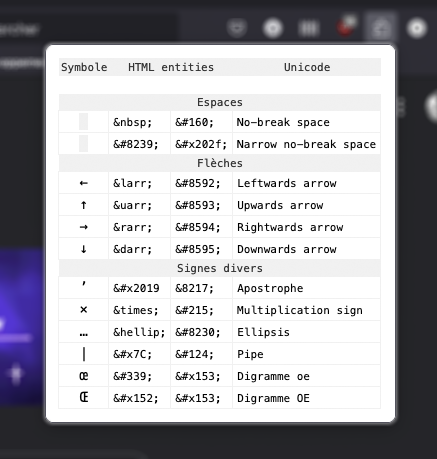

# Personal Special Characters

A Firefox addon based on [Special Characters](https://addons.mozilla.org/fr/firefox/addon/unicode-characters/) by [Phil Tsaryk](https://github.com/phts), but adapted to my personnal needs, with a very short list of characters.

By clicking on the cells of the list, you can copy/paste HTML entities or glyphs from a Unicode character.

